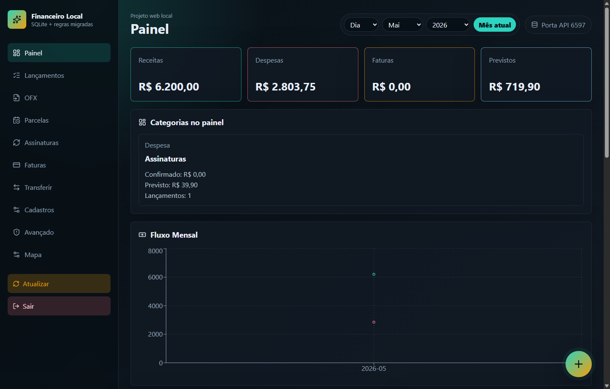
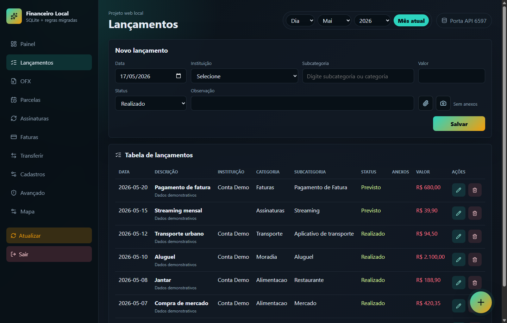
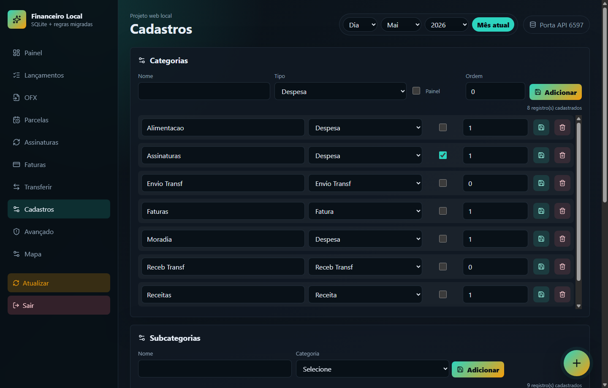
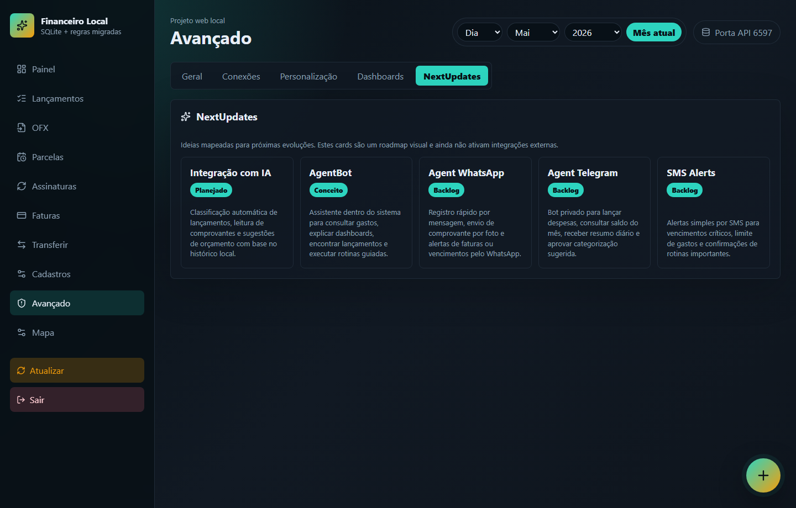

# Financeiro Local

Sistema financeiro web local criado a partir da análise de uma planilha XLSM com macros, fórmulas, OFX, parcelamentos e painel financeiro.

O projeto roda em rede local ou via VPN, com frontend React/Vite, API Node/Express e banco SQLite por padrão.

## Principais recursos

- Painel com filtros de dia, mês e ano.
- Cards de receitas, despesas, faturas, previstos e orçamentos.
- Alertas de orçamento com percentuais configuráveis.
- Gráficos de fluxo mensal, top categorias e top subcategorias.
- Configuração avançada de dashboards, regras, modelos de gráficos, visibilidade e aparência.
- Lançamentos manuais com entrada, saída, previsto, anexos de arquivo e foto.
- Busca inteligente de subcategoria por nome da subcategoria ou da categoria.
- Edição e exclusão de lançamentos.
- Parcelamentos com quantidade de parcelas, juros, antecipação, quitação e reabertura.
- Assinaturas mensais ou anuais, sem quantidade fixa de parcelas.
- Importação OFX com prevenção de duplicidade por hash e FITID.
- Sugestões de subcategoria na prévia do OFX.
- Cadastro de categorias, subcategorias, instituições e regras automáticas.
- Personalização de tema, cores, densidade e posição do botão flutuante.
- Configuração da pasta local de anexos.
- Preparação para migração/exportação para SQLite externo, SQL Server e planilha.
- Autenticação local por senha para uso em rede local ou VPN.
- Instâncias individuais, com banco próprio por pessoa, limitadas a 4 instâncias.
- Bot Telegram com vínculo por instância, consultas, alertas e lançamento guiado.
- Backup completo com SQLite, anexos, mídias do Telegram e restauração por instância.
- Central de auditoria, tela de saúde do sistema e relatórios mensais em Excel.

## Capturas de Tela

### Painel



### Lançamentos



### Cadastros



### NextUpdates



## Stack

- React 19
- Vite 8
- Node.js com Express
- SQLite com `better-sqlite3`
- Recharts
- Framer Motion
- Lucide React
- Multer para anexos
- XLSX para integração com planilhas
- MSSQL para preparação de conexão com SQL Server

## Requisitos

- Git.
- Node.js LTS.
- NPM.
- Ferramentas de build do sistema, quando o SQLite nativo precisar compilar.

## Instalação com senha padrão

Os instaladores abaixo preparam o projeto, criam o banco local se ele ainda não existir e aplicam a senha inicial:

```text
123456
```

Depois do primeiro login, altere a senha em:

```text
Avançado > Segurança
```

## Executáveis

O projeto também é distribuído como aplicativo desktop com Electron:

- Windows: instalador `.exe` e executável portátil `.exe`.
- Linux Debian/Ubuntu: pacote `.deb`.

Os executáveis ficam disponíveis em **GitHub Releases**. A versão atual publicada é `v1.0.20`.

Arquivos `.exe` e `.deb` não são versionados diretamente no Git porque passam facilmente de 100 MB. Eles ficam nos assets da Release.

### Baixar versão atual

- [Windows Installer](https://github.com/ruisauloc/financeiro-local/releases/download/v1.0.20/Financeiro-Local-Setup-1.0.20-Windows.exe)
- [Windows Portable](https://github.com/ruisauloc/financeiro-local/releases/download/v1.0.20/Financeiro-Local-1.0.20-Windows-Portable.exe)
- [Linux .deb](https://github.com/ruisauloc/financeiro-local/releases/download/v1.0.20/financeiro_1.0.20_amd64.deb)

Página da Release:

```text
https://github.com/ruisauloc/financeiro-local/releases/tag/v1.0.20
```

### Gerar localmente

```bash
npm run dist:win
npm run dist:linux
npm run dist:mac
```

Para Windows, gere no Windows. Para Linux `.deb`, gere em Linux ou WSL com ambiente Node nativo Linux. O macOS deve ser gerado em macOS.

No app desktop, a senha inicial também é:

```text
123456
```

Os dados do app desktop ficam na pasta local de dados do usuário do sistema operacional, não dentro da pasta do executável.

A versão `1.0.20` nasce com uma base inicial de cadastros sanitizada:

- Categorias, subcategorias e contas/cartões atuais.
- Sem lançamentos, OFX, anexos, assinaturas ou orçamentos.
- Com filtro aplicado para remover nomes pessoais sensíveis antes do empacotamento.

Para levar uma base real para outro computador, use `Avançado > Backup` no computador de origem e restaure o ZIP no destino.

## Instalação manual

```bash
git clone https://github.com/ruisauloc/financeiro-local.git
cd financeiro-local
npm install
npm run dev
```

Na instalação manual, se não houver senha configurada, o sistema pedirá a criação da senha no primeiro acesso.

## URLs padrão

- Interface: `http://127.0.0.1:5179`
- API: `http://127.0.0.1:6397`

Para acessar de outro dispositivo na mesma rede ou pela VPN, use o IP da máquina onde o sistema está rodando:

```text
http://IP_DA_MAQUINA:5179
```

Exemplo:

```text
http://IP_DA_VPN:5179
```

## Primeiro acesso

Com instalador:

- Senha inicial: `123456`.
- Altere em `Avançado > Segurança`.

Sem instalador:

- O sistema solicita a criação de uma senha local no primeiro acesso.

A senha fica gravada com hash no banco SQLite local. Cada navegador ou celular pode fazer login separadamente. O sistema aceita múltiplas sessões.

## Build

```bash
npm run build
```

## Preview do build

```bash
npm run preview
```

## Armazenamento de dados

No modo desenvolvimento, por padrão:

- Banco: `financeiro.sqlite`
- Anexos: `uploads/attachments`
- Porta da API: `6397`
- Porta do frontend: `5179`

No app instalado, os dados ficam na pasta local de dados do usuário do sistema operacional. Exemplos comuns:

- Windows: `%APPDATA%/Financeiro Local`
- Linux: `~/.config/Financeiro Local`
- macOS: `~/Library/Application Support/Financeiro Local`

Esses arquivos e pastas são dados reais de uso e não devem ir para o GitHub.

As portas podem ser alteradas em `Avançado > Geral`. Depois de salvar, reinicie o app para que a API e a interface subam nas novas portas. A configuração local fica em `runtime-config.json`, arquivo ignorado pelo Git.

## O que não vai para o GitHub

O `.gitignore` bloqueia:

- Banco SQLite e arquivos WAL/SHM.
- Pasta de anexos.
- Arquivos OFX.
- Planilhas pessoais.
- Arquivos extraídos da planilha original.
- `.env`.
- `node_modules`.
- `dist`.

## Segurança

O app foi pensado para uso local, rede doméstica/escritório ou VPN privada.

Recursos atuais:

- Senha local obrigatória.
- Senha padrão opcional apenas via instalador.
- Troca de senha em `Avançado > Segurança`.
- Hash de senha com PBKDF2.
- Cookie de sessão HTTP-only.
- Proteção das rotas da API.
- Proteção dos anexos por sessão.
- CORS restrito para origens locais, rede privada e faixa Tailscale.
- Sessões independentes por navegador/dispositivo.

Recomendação: não exponha a aplicação diretamente na internet. Para acesso remoto, prefira VPN.

## Banco externo

Em `Avançado > Conexões`, o sistema permite preparar:

- SQLite em outro arquivo.
- SQL Server.
- Planilha Excel.

No estado atual, a aplicação ainda executa sobre o SQLite local principal. As opções externas servem para testar conexão, criar estrutura, exportar/migrar dados e importar de volta para o SQLite local.

## Backup, auditoria e saúde

Em `Avançado`, a aplicação inclui:

- `Backup`: exporta pacote ZIP completo e restaura a instância atual.
- `Auditoria`: lista eventos sensíveis, como exclusões, alterações, importações OFX, migrações e troca de senha.
- `Saúde`: mostra banco em uso, pasta de anexos, mídias Telegram, portas, instâncias, contagens e últimos eventos.
- `Relatórios`: exporta Excel mensal com resumo, lançamentos, categorias, subcategorias, orçamentos e itens sem subcategoria.

## Telegram Bot

O bot é opcional e configurado em `Avançado > Telegram Bot`.

Recursos:

- Vínculo por instância.
- Consultas como `/resumo`, `/orcamentos`, `/previstos`, `/faturas` e `/top`.
- Lançamento por texto livre.
- Lançamento guiado com `/lancar` ou `/lançar`.
- Alertas com agenda, mensagem personalizada e mídia opcional.

## Documentação

- [Arquitetura](docs/ARQUITETURA.md)
- [Mapeamento da planilha original](docs/MAPEAMENTO-PLANILHA.md)
- [Segurança](docs/SEGURANCA.md)
- [Operação local](docs/OPERACAO-LOCAL.md)
